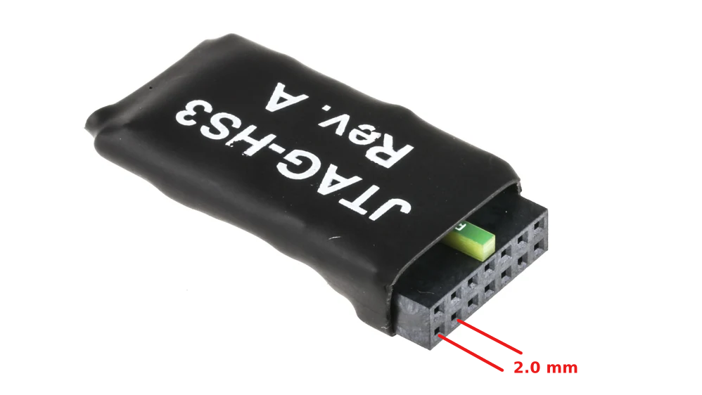
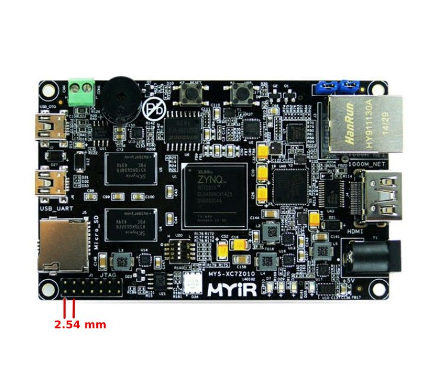

# Xilinx JTAG pitch adapter

Quite a lot of Xilinx SoCs use a 14 pin JTAG connection in order to program the target device.
However, the pitch can vary. For instance, the JTAG-HS3 developed by Digilent has 2.0mm pitch between each adjacent pin
whereas the MYIR-Zturn board containing the Xilinx Zynq 7020 SoC has a 14 pin 2.54mm pitch JTAG connector.
This is visually shown in the two images down below as well. Keep in mind that these images are not scaled.

  
  

This repository tries to solve this issue by hosting the design files and documentation of a passive connector
that converts the 2.0mm pitch 14 pin connector to a 2.54mm pitch 14 pin connector.

